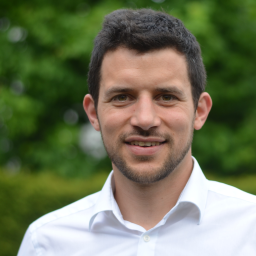

# Tristan Manfred Stöber

- [Think@Ruhr](https://thinkatruhr.de/) Research Fellow at the [Institute for Neural Computation](https://www.ini.rub.de/), Ruhr University Bochum
- Research fellow at the Department of Neurology, [University Hospital Frankfurt](https://www.kgu.de/)

[Scholar](https://scholar.google.com/citations?user=JghW0NoAAAAJ) - [Resume](CV.pdf) - [LinkedIn](https://www.linkedin.com/in/tristan-manfred-st%C3%B6ber-ph-d-941b34160/) - [Contact](mailto:tristan.stoeber@posteo.net)

## About me

Hey, my name is Tristan and I am a Computational Neuroscientist. 

My research agenda revolves around deciphering how the brain builds and uses its internal model of the world, also called cognitive map.
This topic fascinates me for two reasons: First, it is an exciting, yet unresolved, neuroscientific question.
Second, reengineering cognitive map formation in artificial neural networks could lead to intelligent systems that surpass current technology in reliability, speed, and efficiency in terms of data requirements and energy consumption.
To this aim, my students and I build artificial neural networks to explain experimental data and to solve real world challenges.
We focus primarily on the hippocampus because of its key essential role for cognitive map formation.
In addition, I recently started working on neuromorphic hardware and I use my theoretical and physiological knowledge to support research on epilepsy.

Currently, I am employed as a [Think@Ruhr](https://thinkatruhr.de/) Research Fellow at the [Institute for Neural Computation](https://www.ini.rub.de/), Ruhr University Bochum, and as a research fellow at the Department of Neurology, [University Hospital Frankfurt](https://www.kgu.de/) in Germany. Between 2020 and 2022, I worked as a postdoc in the lab of Jochen Triesch at the Frankfurt Institute for Advanced Studies on questions related to synaptic lifetime, criticality, and epileptogenesis.

In 2021, I earned my Doctor of Philosophy from the University of Oslo as part of the [Simula-UiO-UCSD Research and PhD training program](https://www.simula.no/education/research-exchanges/suurph/). Supervised by Arvind Kumar, Marianne Fyhn, and Jill Leutgeb, my PhD research led to the development of a theory for the computational role of the hippocampal region CA2. Prior to this, I obtained a Master's degree at the University of Freiburg, studying Computational Neuroscience at the [Bernstein Center Freiburg](https://www.bcf.uni-freiburg.de/).

Besides neuroscience, I am passionate about developing new ways of publishing, and supporting students in difficult circumstances, such as in Iran. In moments of spare time, I cherish spending time with my wife and our four kids as well as doing all kinds of sports.

## Publications
A comprehensive list of my recent publications can be found on my [Google Scholar profile](https://scholar.google.com/citations?user=JghW0NoAAAAJ).
